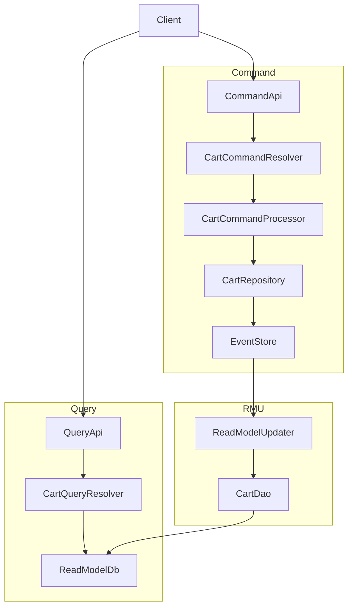
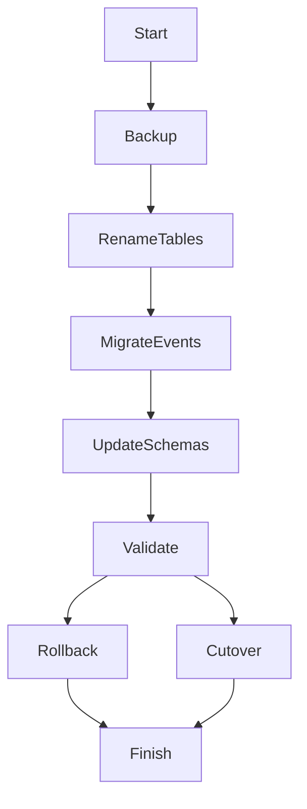

# 技術設計書: rename-order-to-cart

## 概要
本機能は、Order という用語を Cart に統一し、ドメイン/API/モジュール境界/テスト/ドキュメントの名称を一貫させる。対象は既存の CQRS/ES 構成の命名のみであり、振る舞いの変更は行わない。

主要利用者は開発者と API 利用者であり、Cart の語彙で読み書き操作を理解できる状態を提供する。これにより、ドメイン理解の認知負荷を下げ、仕様駆動開発の作業効率を高める。

### 目標
- Order 名称を Cart に全面的に置換し、公開 API から Order を排除する。
- ドメイン/コマンド/クエリ/RMU/ブートストラップの境界で Cart の語彙を統一する。
- テスト/スクリプト/ドキュメントを Cart 名に合わせて整合させる。

### 非目標
- ドメインロジックやビジネスルールの追加・変更。
- 既存 Order 名との後方互換性の維持。
- 新規外部依存関係の導入。

## 要件トレーサビリティ

| Requirement | Summary | Components | Interfaces | Flows |
|-------------|---------|------------|------------|-------|
| 1.1 | ドメイン公開型/イベント/エラーを Cart 名に変更 | CartAggregate, CartEvents, CartErrors | Domain API | - |
| 1.2 | Order 名の公開型を排除 | 全ドメイン公開エクスポート | Domain API | - |
| 2.1 | GraphQL のクエリ/ミューテーション/入出力型を Cart 名に統一 | CartCommandAPI, CartQueryAPI | GraphQL API | - |
| 2.2 | DTO/GraphQL から Order 名を排除 | GraphQL Inputs/Outputs | GraphQL API | - |
| 3.1 | モジュール境界の公開型/関数名を Cart 名に変更 | CartRepository, CartCommandProcessor, CartDao, ReadModelUpdater | Service | - |
| 3.2 | 境界 API から Order 名を排除 | 全公開エクスポート | Service | - |
| 4.1 | Cart 名で書かれたテストが通る | 全テスト群 | Test | - |
| 4.2 | ドキュメント/スクリプト表記の Cart 統一 | Docs, Tools | - | - |

## アーキテクチャ

### 既存アーキテクチャ分析
- DDD + CQRS/ES の分離構造を維持する。
- Command/Query/RMU/Bootstrap が独立パッケージとして存在し、境界の依存方向を保つ。
- イベントストアは DynamoDB、リードモデルは PostgreSQL を使用し、Prisma が橋渡しを行う。
- テストは実装ファイルの隣に `*.test.ts` で配置する。

### アーキテクチャパターンと境界マップ
**アーキテクチャ統合**:
- 選択パターン: CQRS/ES + Ports and Adapters（既存構造を保持）
- 境界: Cart 集約を中心に Command/Query/RMU の責務分離を維持
- 既存パターン維持: リポジトリインタフェース、GraphQL Resolver、RMU のイベント購読
- 新規コンポーネント: 作成せず既存の名称を変更する
- ステアリング適合: レイヤ分離と型安全の原則を維持



### 技術スタック

| Layer | Choice / Version | Role in Feature | Notes |
|-------|------------------|-----------------|-------|
| Backend / Services | TypeScript, Node.js 20+ | 名称変更の実装対象 | 既存スタックを維持 | 
| API | TypeGraphQL, Apollo Server | GraphQL 名称の変更 | 既存バージョンに準拠 | 
| Data / Storage | DynamoDB, PostgreSQL, Prisma | イベント/リードモデルの名称変更 | 既存スキーマをリネーム | 
| Messaging / Events | DynamoDB Streams | RMU 更新の入口 | 既存構成を維持 | 
| Infrastructure / Runtime | pnpm workspace, Turborepo | モノレポ構成 | 変更なし | 

## コンポーネントとインタフェース

### コンポーネント要約
| Component | Domain/Layer | Intent | Req Coverage | Key Dependencies (P0/P1) | Contracts |
|-----------|--------------|--------|--------------|--------------------------|-----------|
| CartAggregate | Domain | Cart 集約の状態とイベントを保持 | 1.1, 1.2 | - | State |
| CartRepository | Command IF | Cart 集約の永続化境界 | 3.1, 3.2 | EventStore (P0) | Service |
| CartCommandProcessor | Command | Cart 操作のユースケース処理 | 2.1, 3.1 | CartRepository (P0) | Service |
| CartCommandAPI | Command API | GraphQL ミューテーションの公開 | 2.1, 2.2 | CartCommandProcessor (P0) | API |
| CartQueryAPI | Query API | GraphQL クエリの公開 | 2.1, 2.2 | ReadModelDb (P0) | API |
| ReadModelUpdater | RMU | Cart イベントからリードモデルを更新 | 3.1 | CartDao (P0) | Event, Service |
| CartDao | RMU | Cart リードモデルの永続化 | 3.1 | PrismaClient (P0) | Service |

### ドメイン

#### CartAggregate

| Field | Detail |
|-------|--------|
| Intent | Cart 集約の状態と不変条件を保持する |
| Requirements | 1.1, 1.2 |

**Responsibilities & Constraints**
- CartId/CartName/CartItem(s) を保持する。
- CartCreated/CartItemAdded/CartItemRemoved/CartDeleted を生成する。
- Order 名の公開型を一切提供しない。

**Dependencies**
- Inbound: CartCommandProcessor — 集約生成/更新 (P0)
- Outbound: -
- External: -

**Contracts**: State [x]

##### State Management
- State model: Cart（id, name, items, deleted, version, sequenceNumber）
- Persistence & consistency: Repository 経由でイベントとスナップショットを保持
- Concurrency strategy: 既存の EventStore バージョニングを踏襲

**Implementation Notes**
- Integration: 既存の Aggregate インタフェースを維持する。
- Validation: CartName/CartItem の検証は既存ルールを継続。
- Risks: 旧 Order 名のイベントが混在すると復元に失敗する。

### コマンド

#### CartRepository

| Field | Detail |
|-------|--------|
| Intent | Cart のイベント/スナップショット永続化境界 |
| Requirements | 3.1, 3.2 |

**Responsibilities & Constraints**
- EventStore との境界を Cart 名で提供する。
- Order 名の公開型を提供しない。

**Dependencies**
- Inbound: CartCommandProcessor — 永続化要求 (P0)
- Outbound: EventStore — イベント保存/取得 (P0)
- External: -

**Contracts**: Service [x]

##### Service Interface
```typescript
interface CartRepository {
  withRetention(numberOfEvents: number): CartRepository;
  storeEvent(event: CartEvent, version: number): TaskEither<RepositoryError, void>;
  storeEventAndSnapshot(event: CartEvent, snapshot: Cart): TaskEither<RepositoryError, void>;
  store(event: CartEvent, snapshot: Cart): TaskEither<RepositoryError, void>;
  findById(id: CartId): TaskEither<RepositoryError, Cart | undefined>;
}
```
- Preconditions: id が CartId として妥当である。
- Postconditions: イベント/スナップショットが保存される。
- Invariants: Order 名の公開型を返さない。

#### CartCommandProcessor

| Field | Detail |
|-------|--------|
| Intent | Cart のユースケース処理を提供する |
| Requirements | 2.1, 3.1 |

**Responsibilities & Constraints**
- createCart/addItemToCart/removeItemFromCart/deleteCart を提供する。
- エラー型は Cart 系に統一する。

**Dependencies**
- Inbound: CartCommandResolver — ユースケース呼び出し (P0)
- Outbound: CartRepository — 永続化 (P0)
- External: -

**Contracts**: Service [x]

##### Service Interface
```typescript
interface CartCommandProcessor {
  createCart(name: CartName, executorId: UserAccountId): TaskEither<ProcessError, CartEvent>;
  addItemToCart(id: CartId, item: CartItem, executorId: UserAccountId): TaskEither<ProcessError, CartEvent>;
  removeItemFromCart(id: CartId, itemId: CartItemId, executorId: UserAccountId): TaskEither<ProcessError, CartEvent>;
  deleteCart(id: CartId, executorId: UserAccountId): TaskEither<ProcessError, CartEvent>;
}
```
- Preconditions: 入力値が Cart 系の型で検証済みである。
- Postconditions: CartEvent が返却される。
- Invariants: ProcessError は Cart 系のエラーに対応する。

#### CartCommandAPI

| Field | Detail |
|-------|--------|
| Intent | GraphQL ミューテーションを Cart 名で公開する |
| Requirements | 2.1, 2.2 |

**Responsibilities & Constraints**
- `createCart`, `addItemToCart`, `removeItemFromCart`, `deleteCart` を公開する。
- 入出力型は `CreateCartInput`, `AddItemToCartInput`, `RemoveItemFromCartInput`, `DeleteCartInput`, `CartOutput`, `CartItemOutput` とする。

**Dependencies**
- Inbound: GraphQL client — API 呼び出し (P0)
- Outbound: CartCommandProcessor — ユースケース (P0)
- External: -

**Contracts**: API [x]

##### API Contract
| Method | Endpoint | Request | Response | Errors |
|--------|----------|---------|----------|--------|
| Mutation | createCart | CreateCartInput | CartOutput | ProcessError |
| Mutation | addItemToCart | AddItemToCartInput | CartItemOutput | ProcessError |
| Mutation | removeItemFromCart | RemoveItemFromCartInput | CartOutput | ProcessError |
| Mutation | deleteCart | DeleteCartInput | CartOutput | ProcessError |

### クエリ

#### CartQueryAPI

| Field | Detail |
|-------|--------|
| Intent | GraphQL クエリを Cart 名で公開する |
| Requirements | 2.1, 2.2 |

**Responsibilities & Constraints**
- `getCart`, `getCarts`, `getCartItem`, `getCartItems` を公開する。
- 出力型は `CartQueryOutput`, `CartItemQueryOutput` とする。

**Dependencies**
- Inbound: GraphQL client — API 呼び出し (P0)
- Outbound: ReadModelDb — 参照 (P0)
- External: -

**Contracts**: API [x]

##### API Contract
| Method | Endpoint | Request | Response | Errors |
|--------|----------|---------|----------|--------|
| Query | getCart | cartId | CartQueryOutput | NotFound |
| Query | getCarts | - | CartQueryOutput[] | - |
| Query | getCartItem | cartItemId | CartItemQueryOutput | NotFound |
| Query | getCartItems | cartId | CartItemQueryOutput[] | - |

### RMU

#### ReadModelUpdater

| Field | Detail |
|-------|--------|
| Intent | Cart イベントからリードモデルを更新する |
| Requirements | 3.1 |

**Responsibilities & Constraints**
- CartCreated/CartItemAdded/CartItemRemoved/CartDeleted を購読する。
- Order 名のイベントを扱わない。

**Dependencies**
- Inbound: EventStore stream — イベント供給 (P0)
- Outbound: CartDao — 永続化 (P0)
- External: DynamoDB Streams — イベント配送 (P0)

**Contracts**: Service [x] / Event [x]

##### Event Contract
- Subscribed events:
  - CartCreated { aggregateId, name, executorId, sequenceNumber, occurredAt }
  - CartItemAdded { aggregateId, item, executorId, sequenceNumber, occurredAt }
  - CartItemRemoved { aggregateId, item, executorId, sequenceNumber, occurredAt }
  - CartDeleted { aggregateId, executorId, sequenceNumber, occurredAt }
- Ordering / delivery guarantees: 既存の DynamoDB Streams 順序を踏襲

#### CartDao

| Field | Detail |
|-------|--------|
| Intent | Cart リードモデルの永続化境界 |
| Requirements | 3.1 |

**Responsibilities & Constraints**
- `insertCart`, `deleteCart`, `insertCartItem`, `deleteCartItem` を提供する。
- Order 名の型を受け取らない。

**Dependencies**
- Inbound: ReadModelUpdater — 更新要求 (P0)
- Outbound: PrismaClient — DB アクセス (P0)
- External: PostgreSQL — 永続化 (P0)

**Contracts**: Service [x]

##### Service Interface
```typescript
interface CartDao {
  insertCart(aggregateId: CartId, name: CartName, createdAt: Date): Promise<void>;
  deleteCart(aggregateId: CartId, updatedAt: Date): Promise<void>;
  insertCartItem(aggregateId: CartId, item: CartItem, createdAt: Date): Promise<void>;
  deleteCartItem(itemId: CartItemId): Promise<void>;
}
```
- Preconditions: CartId/CartItemId が妥当である。
- Postconditions: carts/cart_items にレコードが反映される。
- Invariants: Order 名のテーブルを使用しない。

## データモデル

### ドメインモデル
- Aggregate: Cart
- Entities: CartItem
- Value Objects: CartId, CartItemId, CartName
- Domain Events: CartCreated, CartItemAdded, CartItemRemoved, CartDeleted
- Invariants: 削除済み Cart への追加・削除は禁止（既存ルールを継続）

### 論理データモデル
- `Carts` と `CartItems` を主エンティティとする。
- `CartItems` は `cartId` を外部キーとして `Carts` に従属する。
- 参照整合性は `cart_id` 外部キーとインデックスで維持する。

### 物理データモデル
**Relational**
- tables: `carts`, `cart_items`
- keys: `carts.id` (PK), `cart_items.id` (PK), `cart_items.cart_id` (FK)
- indexes: `cart_items.cart_id`

**Event Store**
- Event schema: `Cart*` 型名と payload 構造を採用する。
- Snapshot policy: 既存の retention ルールを維持する。

### データ契約と連携

**API Data Transfer**
- GraphQL Input: CreateCartInput, AddItemToCartInput, RemoveItemFromCartInput, DeleteCartInput
- GraphQL Output: CartOutput, CartItemOutput, CartQueryOutput, CartItemQueryOutput
- Validation rules: CartId/CartItemId/CartName/CartItem の既存検証を継続

**Event Schemas**
- Payload 共通項目: aggregateId, executorId, sequenceNumber, occurredAt
- CartItemAdded/Removed には item が含まれる
- Schema versioning: 既存のイベント構造を踏襲し、名称のみ変更する

## エラーハンドリング

### エラーストラテジ
- ドメインエラーは Cart 系に統一し、プロセスエラーへ変換する。
- GraphQL は既存のエラーハンドリングを維持し、メッセージ内の Order を Cart に置換する。

### エラーカテゴリと応答
- User Errors: 無効入力はフィールド単位で検証する。
- System Errors: 永続化失敗は ProcessInternalError として返す。
- Business Logic Errors: 削除済み Cart への追加/削除は CartAddItemError/CartRemoveItemError として扱う。

### 監視
- 既存のロギングを維持し、ログメッセージ内の Order を Cart に変更する。

## テスト戦略

- Unit Tests:
  - CartId/CartItemId/CartName の生成・検証
  - CartAggregate のイベント生成と不変条件
  - CartRepository/CartDao の入出力契約
- Integration Tests:
  - CartCommandProcessor のエラーパス/成功パス
  - GraphQL Command/Query のスキーマ生成
  - RMU のイベント購読処理
- E2E Tests:
  - `verify-cart` で createCart/addItemToCart/removeItemFromCart/deleteCart を検証

## 移行戦略



- 既存データ保持が必要な環境では、テーブル名とイベント型名の移行を実施する。
- 保持不要な環境では、DB 再作成とイベントストア初期化で代替できる。
- 移行検証は GraphQL の Cart API と RMU の更新を基準に実施する。

## 参考情報
- 詳細な調査ログと判断根拠は `.kiro/specs/rename-order-to-cart/research.md` に集約する。
